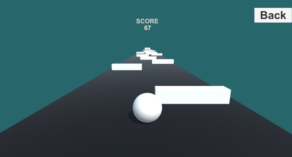
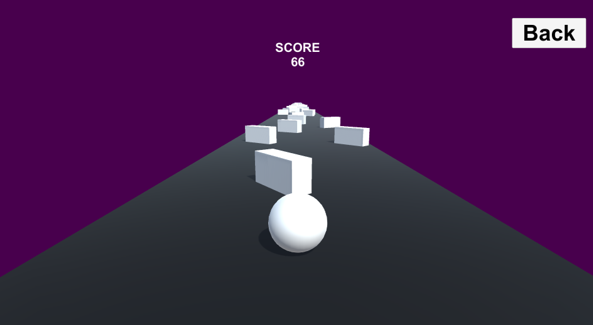

# Rolling Ball

A 3D obstacle avoidance game developed in Unity as a personal learning project focused on player movement, level progression, and gameplay mechanics.

## Overview

Rolling Ball is a fast-paced 3D game where players control a rolling ball and navigate through a floating track while avoiding obstacles.

As the game progresses, the ball's speed gradually increases, making the gameplay more challenging. Falling off the track results in mission failure and requires the player to restart.

The game includes multiple levels with increasing difficulty and different obstacle layouts.

## Features

- 3D gameplay environment
- Multiple playable levels
- Progressive difficulty system
- Increasing ball speed
- Obstacle avoidance mechanics
- Restart and fail system
- Physics-based movement
- Simple and engaging gameplay

## Technologies Used

- Unity
- C#
- Visual Studio
- Git
- GitHub

## Gameplay

### Objective

Control the rolling ball, avoid obstacles, stay on the track, and successfully reach the end of each level.

### Failure Conditions

- Falling off the track
- Hitting obstacles

## Screenshots

### Level 1

### Level 2

## Gameplay Video

Gameplay footage is available in the repository.

[🎮 Watch Gameplay Video](Gameplay/Gameplay.mp4)

## Download

A playable build of the game is included in this repository.

## What I Learned

Through this project, I gained hands-on experience with:

- Unity Game Engine fundamentals
- Physics-based player movement
- Collision detection
- Obstacle design and placement
- Scene management
- Level progression systems
- Debugging and testing
- Version control using Git and GitHub

## Future Improvements

- Additional levels
- Enhanced visual effects
- More obstacle types
- Improved user interface
- Checkpoint system

## Author

**Muhammad Ibrahim**

- GitHub: https://github.com/mibrahim999
- LinkedIn: https://linkedin.com/in/muhammad-ibrahim0981122

---
*Developed as a personal Unity game development project.*